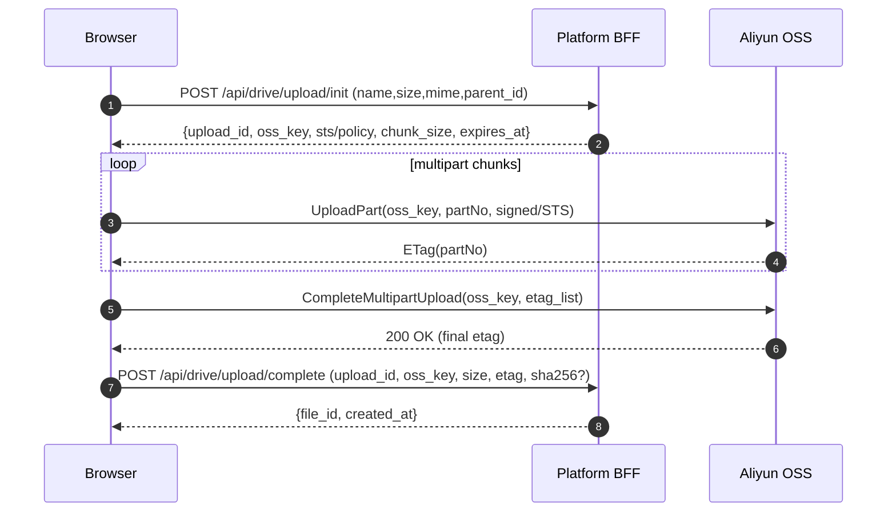
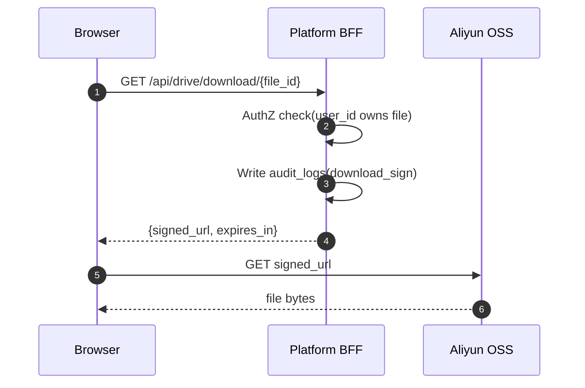
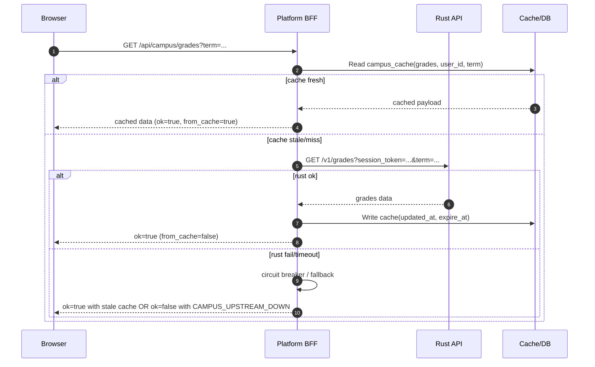

# 分账户网页版桌面系统 PRD / 需求文档（可上线版）

> 版本：v1.1（已补齐：Rust 校园 API 接口契约 + 错误码规范 + 时序图）  
> 目标上线形态：可上线、可运维、可扩展（OSS 直传 + 校园数据由第三方 Rust 接口提供）  
> 当前已确定方案：  
> - 校园数据来源：学校学生开发的第三方 **Rust 接口**（建议平台后端做 BFF 统一接入）  
> - 网盘上传：**客户端直传**  
> - 对象存储：**阿里云 OSS**  
> - 校园能力基础：Rust 侧可基于 `rsmycqu`（Rust 版 `pymycqu`）实现 SSO / 教务网能力与数据模型fileciteturn0file0L1-L20

---

## 1. 背景与目标

### 1.1 产品定位
一个 “Web Desktop（网页版桌面）” 系统，支持分账户使用。桌面内提供：

- **网盘（Cloud Drive）**：文件元数据由平台后端管理；文件对象存储在阿里云 OSS；上传走客户端直传。
- **校园应用套件（Campus Suite）**：查课表、查成绩、校园论坛、校园地图。数据通过第三方 Rust API 获取。
- **静态小游戏（Games）**：作为桌面应用独立运行（你已实现）。

### 1.2 上线目标
- **可上线**：安全、权限隔离、稳定性、可观测性、运维能力具备。
- **分账户隔离**：文件、校园数据缓存、桌面设置、日志审计全部按用户隔离。
- **模块化**：桌面壳与各应用解耦，便于后续接入“远程服务器任务”（转码/解压/扫描/缩略图等）。

### 1.3 非目标（本期不做 / 可延后）
- 在线 Office / 多人实时协作编辑。
- 全量 OCR/全文检索。
- 原生桌面客户端（Electron/Flutter Desktop 等）。

---

## 2. 用户、角色与权限

### 2.1 角色
- **普通用户**：使用桌面、网盘、校园套件、小游戏。
- **平台管理员**：用户管理、配额、审计、OSS 配置、校园接口配置与健康监控。

> 预留扩展：未来可引入 tenant_id 做组织/学院级隔离；本期以 user_id 强隔离为主。

### 2.2 权限模型（RBAC 最小版）
- `USER`：仅访问自己的资源（files/settings/campus_cache）。
- `ADMIN`：管理后台权限（用户、配置、审计、系统健康）。

### 2.3 数据隔离硬要求
- 所有资源表都必须带 `user_id`（可选 `tenant_id`），并在后端鉴权层强校验。
- 前端隐藏不是权限控制；必须后端拦截。

---

## 3. 总体功能范围

### 3.1 Web Desktop（桌面壳）
**功能：**
- 登录/注册/找回密码
- 桌面布局：图标、分组、壁纸、主题、快捷搜索、最近使用
- 窗口系统：打开/最小化/最大化/拖拽/层级管理/多窗口
- 通知中心：上传任务、论坛消息、系统公告、错误提示（携带 request_id）
- 全局搜索：应用搜索 + 文件名搜索（MVP）

**验收：**
- 桌面布局、主题、壁纸可持久化，并在多设备“最终一致”（最后保存覆盖）。

### 3.2 网盘（Cloud Drive）
#### 3.2.1 核心能力（MVP）
- 文件/文件夹：新建、重命名、移动、删除（软删除）、恢复
- 上传/下载：支持大文件（分片 + 断点续传）
- 列表与排序：分页，按名称/时间/大小/类型
- 搜索：按文件名模糊搜索
- 预览：图片、PDF、文本（视频音频后续增强）
- 回收站：保留期可配置（默认 30 天）

#### 3.2.2 分享（建议上线即包含）
- 分享链接：可设置有效期、提取码、权限（预览/下载）
- 撤销分享：立即失效
- 分享访问审计：IP/UA/时间/次数

#### 3.2.3 配额与风控（上线必备）
- 每用户配额：总容量、单文件最大、日上传量、日下载量
- 限流：上传初始化、下载签名、分享访问
- 滥用处置：异常下载/分享可封禁账号

### 3.3 校园应用（Campus Suite，第三方 Rust API）
> 平台后端建议作为 **BFF（Backend For Frontend）**：统一鉴权、缓存、熔断、限流、审计与错误码。  
> 不建议前端直连 Rust API。

- 查课表：周/日视图、课程详情、导出（可选）
- 查成绩：学期/课程成绩、统计（可选）
- 校园论坛：板块/帖子/评论、发帖/评论、举报/封禁（最小版）
- 校园地图：POI 列表、搜索、基础展示

---

## 4. 非功能需求（上线门槛）

### 4.1 性能指标（建议）
- 桌面首屏：≤ 2s（常规网络）
- 网盘列表：P95 ≤ 300ms（缓存/索引命中）
- 下载签名接口：≤ 200ms
- 校园数据接口：P95 ≤ 1s（Rust API 正常时）

### 4.2 可靠性与降级
- Rust API 不可用：课表/成绩/POI 返回最近缓存 + 明确提示更新时间
- 熔断：Rust API 连续失败达到阈值后短时间熔断，避免雪崩
- 重试：仅读接口可重试（1~2 次，指数退避）

### 4.3 可观测性（必做）
- 结构化日志：`request_id`、`user_id`、IP、UA、latency、status
- 指标：错误率、P95 延迟、Rust API 成功率、缓存命中率、OSS 上传失败率
- 告警：Rust API 健康异常、错误率激增、DB 连接异常、磁盘/内存告警

---

## 5. 安全与合规

### 5.1 身份认证
- access token（短期）+ refresh token（长期）或服务端 session（二选一）
- 密码：bcrypt/argon2
- 登录保护：失败次数限制 + 冷却时间

### 5.2 OSS 安全原则（关键）
- 前端 **不得**持有长期 AK/SK
- 仅使用：STS 临时凭证 / PostPolicy 签名 / 服务端签名 URL
- 签名 URL：短期有效（1~10 分钟）

### 5.3 校园凭据安全
- 若平台需保存校园账号凭据：必须服务端加密存储（密钥不入库）
- 提供解绑与删除：删除后不可继续查询
- 绑定/查询限流：避免触发校方风控或 Rust API 封禁

---

## 6. 系统架构（建议落地）

### 6.1 逻辑架构
- **Web 前端**：桌面壳 + 应用（网盘/校园/小游戏）
- **平台后端（BFF）**：Auth、Drive、Campus、Admin、Audit、Task（后续）
- **第三方 Rust API**：对接校内系统（SSO/教务/论坛/地图）
- **阿里云 OSS**：文件对象存储

### 6.2 强制约束：平台后端必须做“统一出口”
- 前端只认平台域名；Rust API 不对公网直接暴露或至少不暴露给前端（避免绕过鉴权与风控）。

---

## 7. 数据模型（建议表）

### 7.1 核心表（MVP）
- `users(id, email/phone, password_hash, status, created_at, last_login_at)`
- `user_settings(user_id, desktop_layout_json, theme, wallpaper, updated_at)`
- `files(id, user_id, parent_id, name, size, mime, oss_key, etag, sha256, created_at, deleted_at)`
- `shares(id, owner_user_id, file_id, token, password_hash, perms, expire_at, created_at, revoked_at)`
- `audit_logs(id, user_id, action, target_type, target_id, ip, ua, request_id, created_at, extra_json)`
- `campus_accounts(id, user_id, school_code, encrypted_credential, status, updated_at)`
- `campus_cache(id, user_id, type, payload_json, updated_at, expire_at)`

### 7.2 论坛（若平台侧落库/自建）
- `forum_boards, forum_posts, forum_comments, forum_reports, forum_bans`

---

## 8. API 设计（平台对前端）

> 统一返回格式：见第 10 节《错误码与响应规范》。  
> 所有接口默认需要 `Authorization: Bearer <access_token>`（除登录注册、分享页等）。

### 8.1 Auth
- `POST /api/auth/register`
- `POST /api/auth/login`
- `POST /api/auth/refresh`
- `POST /api/auth/logout`
- `GET /api/auth/me`
- （可选）`GET /api/auth/sessions`、`DELETE /api/auth/sessions/{id}`

### 8.2 Desktop
- `GET /api/desktop/settings`
- `PUT /api/desktop/settings`
- `GET /api/desktop/apps`

### 8.3 Drive（OSS 直传）
- `GET /api/drive/list?parent_id=...&page=...`
- `POST /api/drive/folder`
- `POST /api/drive/rename`
- `POST /api/drive/move`
- `DELETE /api/drive/delete`
- `GET /api/drive/trash`
- `POST /api/drive/restore`
- `POST /api/drive/upload/init`
- `POST /api/drive/upload/complete`
- `GET /api/drive/download/{file_id}`
- `POST /api/drive/share`
- `POST /api/drive/share/revoke`

### 8.4 Share（匿名访问）
- `GET /share/{token}`（分享页元信息）
- `POST /share/{token}/download`（提取码校验后返回签名 URL）

### 8.5 Campus（平台聚合 Rust API）
- `POST /api/campus/bind`
- `POST /api/campus/unbind`
- `GET /api/campus/timetable?term=...&week=...`
- `GET /api/campus/grades?term=...`
- `GET /api/campus/forum/boards`
- `GET /api/campus/forum/posts?board_id=...&page=...`
- `GET /api/campus/forum/posts/{post_id}`
- `POST /api/campus/forum/post`
- `POST /api/campus/forum/comment`
- `GET /api/campus/map/poi?campus=...&q=...`

### 8.6 Admin（仅 ADMIN）
- `GET /api/admin/users`
- `PUT /api/admin/users/{id}/status`（封禁/解封）
- `GET /api/admin/audit`
- `PUT /api/admin/config/storage`（OSS/ST S）
- `PUT /api/admin/config/campus`（Rust API base_url/超时/熔断阈值等）
- `PUT /api/admin/config/limits`（配额与限流参数）

---

## 9. 校园第三方 Rust API：接口契约（平台对 Rust）

> 这部分是“平台后端”与“Rust API”之间的契约。  
> 目标：Rust API 改动时，平台能通过适配层（DTO）兜住前端。  
> Rust 侧能力可基于 `rsmycqu` 完成 SSO 与教务网权限获取等fileciteturn0file0L21-L48，并遵循其 Session/Token 存储方式fileciteturn0file0L49-L77。

### 9.1 通用约束
- 通信：平台 -> Rust API 走内网或 mTLS（建议）
- 超时：2~5s
- 幂等：对写接口支持 `Idempotency-Key`（避免重复发帖/评论）
- Rust API 必须提供健康检查：`GET /healthz`

### 9.2 Rust API 统一返回格式（建议）
```json
{
  "ok": true,
  "data": {},
  "error": null,
  "request_id": "rust-req-xxxx"
}
```

### 9.3 Rust API 端点（建议命名，可按实际调整）

#### 9.3.1 绑定与会话
- `POST /v1/session/login`
  - 入参：`{ "auth": "...", "password": "...", "force_relogin": false }`
  - 出参：`{ "session_token": "...", "expires_at": 1700000000 }`
  - 说明：Rust 侧内部维护 Session（类似 `rsmycqu::Session`）fileciteturn0file0L23-L41

- `POST /v1/session/logout`
  - 入参：`{ "session_token": "..." }`
  - 出参：`{ "success": true }`

> 备注：如果 Rust API 不愿管理 session_token，也可让平台保存加密凭据并每次调用由 Rust API 现登；但会更慢、更容易触发风控。

#### 9.3.2 课表
- `GET /v1/timetable?session_token=...&term=...&week=...`
- Response `TimetableResponse`：
```json
{
  "term": "2025-2026-1",
  "week": 3,
  "updated_at": 1700000000,
  "courses": [
    {
      "name": "数据结构",
      "teacher": "张三",
      "location": "A区-第3教学楼-201",
      "weekday": 1,
      "start_section": 1,
      "end_section": 2,
      "weeks": [1,2,3,4,5,6,7],
      "remark": ""
    }
  ]
}
```

#### 9.3.3 成绩
- `GET /v1/grades?session_token=...&term=...`
- Response `GradesResponse`：
```json
{
  "term": "2025-2026-1",
  "updated_at": 1700000000,
  "items": [
    { "course": "高等数学", "credit": 4.0, "grade": 92, "gpa": 4.0, "type": "必修" }
  ],
  "summary": { "gpa": 3.62, "credits": 22.0 }
}
```

#### 9.3.4 论坛（读写按 Rust API 能力提供）
- `GET /v1/forum/boards`
- `GET /v1/forum/posts?board_id=...&page=...`
- `GET /v1/forum/posts/{post_id}`
- `POST /v1/forum/post`
- `POST /v1/forum/comment`

写接口建议入参：
```json
{ "session_token": "...", "title": "...", "content": "...", "board_id": "..." }
```

#### 9.3.5 地图 POI
- `GET /v1/map/poi?campus=...&q=...`
- Response：
```json
{
  "campus": "A",
  "updated_at": 1700000000,
  "pois": [
    { "id": "lib_a", "name": "图书馆", "lat": 29.123, "lng": 106.456, "category": "library", "desc": "" }
  ]
}
```

---

## 10. 错误码与响应规范（平台对前端）

### 10.1 平台统一返回格式
```json
{
  "ok": false,
  "data": null,
  "error": {
    "code": "CAMPUS_UPSTREAM_DOWN",
    "message": "校园服务暂不可用（已返回缓存数据）",
    "detail": { "upstream": "rust_api", "retry_after_sec": 60 }
  },
  "request_id": "req-20260211-xxxx"
}
```

### 10.2 平台错误码（建议最小集合）
| code | 含义 | 典型场景 |
|---|---|---|
| AUTH_UNAUTHORIZED | 未登录/令牌无效 | access token 过期 |
| AUTH_FORBIDDEN | 无权限 | 非 ADMIN 访问管理接口 |
| RATE_LIMITED | 触发限流 | 刷新成绩过频 |
| DRIVE_QUOTA_EXCEEDED | 超出配额 | 上传超容量/超单文件大小 |
| DRIVE_NOT_FOUND | 文件不存在 | file_id 不存在或无权限 |
| DRIVE_UPLOAD_EXPIRED | 上传凭证过期 | init 后太久未上传 |
| SHARE_INVALID | 分享无效 | token 不存在/已撤销 |
| SHARE_PASSWORD_REQUIRED | 需要提取码 | 未提供/错误 |
| CAMPUS_NOT_BOUND | 未绑定校园账号 | 访问课表/成绩 |
| CAMPUS_UPSTREAM_DOWN | Rust API 不可用 | 熔断/超时/5xx |
| CAMPUS_DATA_STALE | 数据过期 | 返回缓存但超过 max_stale |
| INTERNAL_ERROR | 内部错误 | 未分类异常 |

> Rust API 错误应映射为平台错误码（避免前端理解 Rust 的内部枚举）。

---

## 11. 时序图（Mermaid）

### 11.1 OSS 直传上传（分片 + 断点续传）


### 11.2 下载（签名 URL + 审计）


### 11.3 校园数据查询（BFF 缓存 + 熔断降级）


---

## 12. 缓存与熔断策略（建议默认）
- 课表：TTL 6~24h（默认 12h）
- 成绩：TTL 24h（默认 24h）
- POI：TTL 7d（默认 7d）
- 论坛列表：TTL 30~120s（默认 60s）

熔断：Rust API 在 1 分钟窗口内连续失败 ≥ 10 次触发；触发后 30~120 秒熔断（可配置）。

---

## 13. 管理后台（上线最小集合）
- 用户：封禁/解封、查看用量与最近行为
- 配额：容量/单文件/日上行/日下行/分享默认有效期
- OSS：bucket、STS 配置、域名/CDN（可选）
- Campus：Rust API base_url、超时、重试、熔断参数、健康状态
- 审计：按 user/action/time 查询（支持导出）

---

## 14. 验收标准（上线验收）

### 14.1 功能
- 分账户隔离：A 用户无法访问 B 用户的 files/settings/campus_cache
- 网盘闭环：上传（含断点续传）→ 预览/下载 → 删除 → 回收站恢复
- 分享：创建/访问/提取码/撤销 全链路可用
- 校园：Rust API 异常时不白屏，缓存降级提示明确（含更新时间）
- 桌面：布局、主题可持久化，刷新后不丢

### 14.2 安全
- 前端无长期 AK/SK；签名 URL 短期有效
- 登录/绑定/成绩刷新/下载签名/分享访问均限流生效
- 校园凭据加密存储，解绑后可彻底删除
- 审计日志完整（关键操作必留痕，带 request_id）

### 14.3 稳定性
- Rust API 故障触发熔断，系统不雪崩
- 30 分钟高频操作无明显卡死/内存暴涨

---

## 15. 里程碑建议
- M1：Auth + Desktop Shell（设置持久化）
- M2：Drive MVP（直传 OSS + 元数据 + 下载签名 + 回收站）
- M3：分享 + 审计 + Admin 基础
- M4：Campus BFF（接 Rust API + 缓存/熔断/限流）+ 课表/成绩
- M5：论坛/地图完善 + 监控告警 + staging→prod 演练

---

## 16. 附录：对 `rsmycqu` 的依赖注意
- 若 Rust API 基于 `rsmycqu`，建议沿用其 `Session` 设计与权限检查策略fileciteturn0file0L49-L77，避免在缺失 token/权限时“晚失败”。
- `rsmycqu` 仍处于快速开发阶段，需在平台侧预留接口变更适配层与回滚策略fileciteturn0file0L17-L20。
